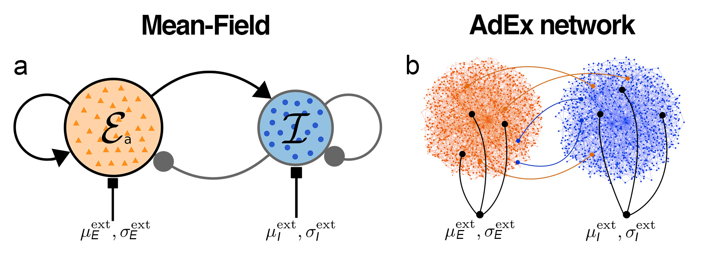
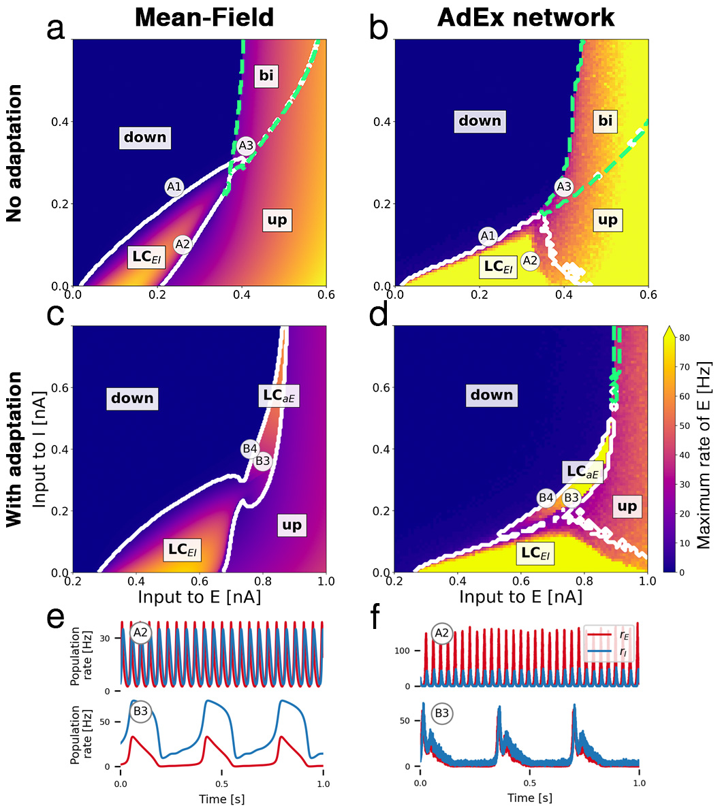
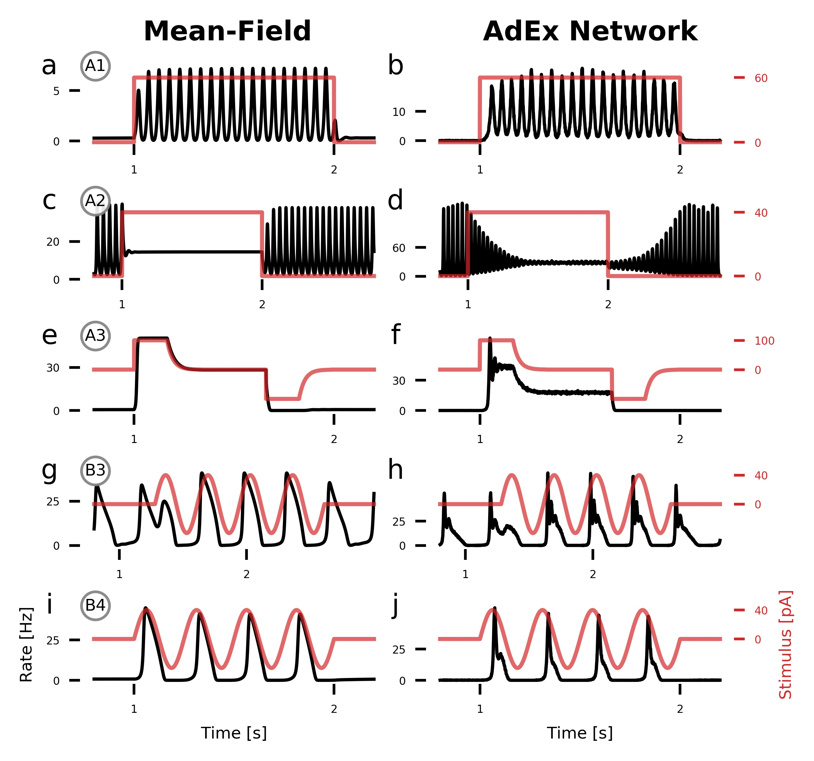

# State-dependent effects of electrical stimulation on populations of excitatory and inhibitory neurons

### Schematic of neural mass model



### Abstract

Electrical stimulation of neural populations is a key tool for understanding neural dynamics and developing treatments. To investigate the effects of external stimulation on a basic cortical motif, we analyse the dynamical properties of an efficient mean-field neural mass model of excitatory and inhibitory adaptive exponential integrate-and-fire (AdEx) neurons and validate the results using detailed network simulations. 
The state space of the mean-field model and of the detailed network are closely related. They reveal asynchronous up and down-states, bistable regions, and oscillatory regions corresponding to fast excitation-inhibition and slow excitation-adaptation feedback loops. 
Within this dynamical landscape, external stimuli can cause state transitions, such as turning on and off oscillations. Oscillatory input can frequency-entrain and phase-lock endogenous oscillations. The effects of external stimulation are well-predicted by the mean-field model, further underpinning the utility of low-dimensional neural mass models. 	


## Getting Started

In this repository, you find the simulation engine for **(a)** an efficient mean-field mneural mass model of a large network of [AdEx neurons](http://www.scholarpedia.org/article/Adaptive_exponential_integrate-and-fire_model) and **(b)** the corresponding network simulation of individual neurons implemented in [Brian2](https://github.com/brian-team/brian2). Furthermore, you will find numerous notebooks to replicate our result and plot them figure by figure. The code within these notebooks runs the simulations and stimulation experiments, saves the data, performs data analysis and plots the results.

### Hardware requirements 
The mean-field simulations are fast by nature and require almost no computational resources for single runs. Running the AdEx network using brian for 6 seconds with N=10000 neurons per population (20000 total) takes in the order of 10 minutes to run on a Intel i5 single core and uses 

### Prerequisites

Please install [anaconda](https://www.anaconda.com/distribution/) for python 2.7 on your computer before you clone this repository. Using conda, you can install the python environment which we have provided here (see Installaltion section). This will ensure that you will be able to run all the code files in this repository. Anaconda will also come with [Jupter Notebook](https://github.com/jupyter/notebook) to run and display the notebooks provided here.

### Installation

If you have a git client installed on your computer, the first step is cloning this repository to your computer:

```
git clone https://github.com/caglarcakan/stimulus_neural_populations.git
```

Alternatively, you can download the repository as a zip file from github [here](https://github.com/caglarcakan/stimulus_neural_populations/archive/master.zip). After cloning or downloading the repository, please navigate in your terminal to the directory which contains the project.

#### Anaconda environment

To make it easier to run the code in this project and reproduce our findings, we have created an anaconda environment. This helps you to get all the correct versions of the libraries we have used as well as python 2.7. Please make sure that you have installed anaconda successfully.

The following command creates the anaconda environment on your computer (this can take a while):

```
conda env create -f environment.yml
```

Now activate the environment:

```
conda activate stimulus
```

You can now start the Jupyter Notebook server to view and run the notebooks in this repository using the command:

```
jupyter notebook
```

This should open Jupyter Notebook in your browser.

### Overview of the repository

Path  | Description
:-------------------- | :------------
&boxvr;&nbsp; data  | Simulation data are saved here.
&boxvr;&nbsp; figures  | Figures are saved here.
&boxvr;&nbsp; **models**  | Contains code for simulations.
&boxv;&nbsp; &boxvr;&nbsp; **aln**  | Mean-field model.
&boxv;&nbsp; &ensp;&ensp; &boxur;&nbsp; aln-precalc  | Precompute quantities for linear-nonlinear cascade.
&boxv;&nbsp; &boxvr;&nbsp; **brian2**  | Brian2 network model.
&boxv;&nbsp; &boxur;&nbsp; utils  | Utility functions.
&boxv;&nbsp;&ensp;&ensp; &ensp;&ensp;  &boxvr;&nbsp; aEIF...py  | Compute equivalent electric field strengths.
&boxv;&nbsp;&ensp;&ensp; &ensp;&ensp; &boxvr;&nbsp; fitparams.py  | Parameters for points of interest.
&boxv;&nbsp;&ensp;&ensp; &ensp;&ensp; &boxvr;&nbsp; functions.py  | Helper function for data analysis.
&boxv;&nbsp;&ensp;&ensp; &ensp;&ensp; &boxvr;&nbsp; paths.py  | Default paths for data storage (**edit this to your needs**).
&boxv;&nbsp;&ensp;&ensp; &ensp;&ensp; &boxvr;&nbsp; pypet....py  | Helper file for parameter exploration with pypet.
&boxv;&nbsp;&ensp;&ensp; &ensp;&ensp; &boxur;&nbsp; runModels.py  | Wrapper for running models easily.
&boxur;&nbsp; **notebooks**  | Contains code for reproduction of figures in the article.
&ensp;&ensp; &ensp;&ensp; &boxvr;&nbsp; figure2  | Bifurcation diagrams.
&ensp;&ensp; &ensp;&ensp; &boxvr;&nbsp; figure3  | Stacked bifurcation diagrams with changing adaptation values.
&ensp;&ensp; &ensp;&ensp; &boxvr;&nbsp; figure4  | Example traces for electrical stimulation.
&ensp;&ensp; &ensp;&ensp; &boxvr;&nbsp; figure5  | Frequency entrainment of the population activity by oscillatory input
&ensp;&ensp; &ensp;&ensp; &boxur;&nbsp; figure6  | Phase locking by oscillatory input.


## Tutorial

Nothing here yet. Please be kindly refered to `notebooks/figure2` for a basic overview on how to load and run the models.

## Selected figures


### Bifurcation diagrams



**Bifurcation diagrams and time series.**
		Bifurcation diagrams a-d depict the state space of the E-I system in terms of the mean external input currents to both subpopulations E and I.
		**(a)** Bifurcation diagram of mean-field model without adaptation with *up* and *down-states*, a bistable region *bi* (green dashed contour) and an oscillatory region LC<sub>EI</sub> (white solid contour). 
		**(b)** Diagram of the corresponding AdEx network. 
		**(c)** Mean-field model with somatic adaptation. The bistable region is replaced by a slow oscillatory region LC<sub>aE</sub>.
		**(d)** Diagram of the corresponding AdEx network.
		The color in panels a - d indicates the maximum population rate of the excitatory population (clipped at 80 Hz). 
		**(e)** Example time series of the population rates of excitatory (red) and inhibitory (blue) populations at point A2 (top row) which is located in the fast excitatory-inhibitory limit cycle LC<sub>EI</sub>, and at point B3 (bottom row) which is located in the slow limit cycle LC<sub>aE</sub>.
		**(f)** Time series at corresponding points for the AdEx network.

### Stimulation experiments



**Population response to time-varying input current is state-dependent.**
		Population rates of the excitatory population (black) with an additional external electrical stimulus (red) applied to the excitatory population.
		**(a, b)** A DC step input with amplitude 60 pA (equivalent E-field amplitude: 6.6 V/m) pushes the system from the low-activity fixed point into the fast limit cycle LC<sub>EI</sub>.
		**(c, d)** A step input with amplitude 40 pA (4.4 V/m) pushes the system from LC<sub>EI</sub> into the *up-state*.
		**(e, f)** In the multistable region *bi*, a step input with amplitude 100 pA (11.0 V/m) pushes the system from the *down-state* into the *up-state* and back.
		**(g ,h)** Inside the slow oscillatory region LC<sub>aE</sub>, an oscillating input current with amplitude $40$ pA and a (frequency-matched) frequency of 3 Hz phase-locks the ongoing oscillation. 
		**(i, j)** A slow 4 Hz oscillatory input with amplitude 40 pA drives oscillations if the system is close to the oscillatory region LC<sub>aE</sub>.

## Information

### Built With

* [Brian2](https://github.com/brian-team/brian2) - A clock-driven simulator for spiking neural networks
* [pypet](https://github.com/SmokinCaterpillar/pypet) - Python parameter exploration toolbox
* [numpy](https://github.com/numpy/numpy) - The fundamental package for scientific computing with Python
* [numba](https://github.com/numba/numba) - NumPy aware dynamic Python compiler using LLVM
* [Jupyter](https://github.com/jupyter/notebook) - Jupyter Interactive Notebook

### Authors

Caglar Cakan*, Klaus Obermayer

Department of Software Engineering and Theoretical Computer Science, Technische Universität Berlin, Germany

Bernstein Center for Computational Neuroscience Berlin, Germany

*cakan@ni.tu-berlin.de

### License

This project is licensed under the BSD 2 - see the [LICENSE](LICENSE) file for details.

## Acknowledgments
* This work was supported by the Deutsche Forschungsgemeinschaft (DFG, German Research Foundation) with the project number 327654276 (SFB 1315) and the Research Training Group GRK1589/2.
* A model comparison of the mean-field population model can be found [in this repository](https://github.com/neuromethods/fokker-planck-based-spike-rate-models) based on the article by Augustin, Ladenbauer, Baumann, Obermayer, *Low-dimensional spike rate models derived from networks of adaptive integrate-and-fire neurons: comparison and implementation*, PLOS Computational Biology 2017. The code for precomputing the filter components of the linear-nonlinear cascade is based on this project as well.
* Aspart et al. layed out the work for converting the electric current amplitudes into extracellular field strengths in *Extending Integrate-and-Fire Model Neurons to Account for the Effects of Weak Electric Fields and Input Filtering Mediated by the Dendrite.* PLoS Computational Biology, 2016. 